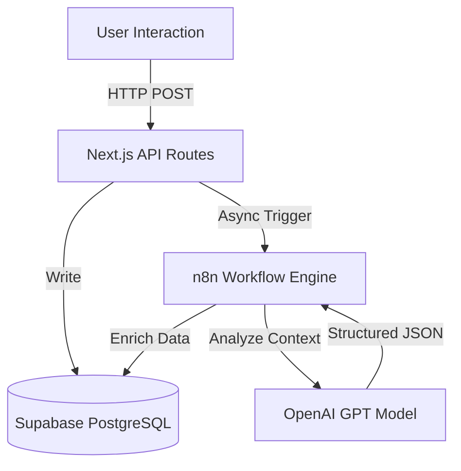

# AI Ops Inbox

A full-stack, asynchronous task management system leveraging Generative AI for automatic context enrichment and structured data parsing.


---

## Demo

https://github.com/user-attachments/assets/demo.mp4

<video src="assets/demo.mp4" width="100%" autoplay loop muted playsinline>
  Your browser does not support the video tag.
</video>

*The task is created instantly via UI while background workers (n8n) enrich the data with priority, tags, and steps without blocking the user.*

---

## Architecture

The system utilizes a decoupled architecture to ensure UI responsiveness. The frontend handles immediate CRUD operations, while heavy AI processing is offloaded to asynchronous n8n workflows.



(Note: If Mermaid charts are not supported in your viewer, refer to the ASCII diagram below)

```text
┌─────────────────┐       ┌──────────────────┐       ┌─────────────────┐
│  Next.js (Web)  │──────►│    n8n Cloud     │──────►│   OpenAI API    │
│  - UI & API     │       │   (Orchestrator) │       │   (Reasoning)   │
└────────┬────────┘       └─────────┬────────┘       └─────────────────┘
         │                          │
         ▼                          ▼
┌──────────────────────────────────────────────────┐
│              SUPABASE (PostgreSQL)               │
│  Tables: tasks, task_steps, users                │
└──────────────────────────────────────────────────┘
```

## Key Features

* **Asynchronous AI Enrichment:** Non-blocking processing of raw inputs into structured metadata (Title, Priority, Tags).
* **Step-by-Step Generation:** Automatically breaks down vague requests into 3-7 actionable steps using Chain-of-Thought prompting.
* **Relational Data Integrity:** Enforces strict JSON schemas in LLM outputs to map correctly to PostgreSQL relational tables.
* **Chat Interface:** Natural language command processing (`add:`, `list`, `done:`) via a dedicated n8n router workflow.
* **Full CRUD API:** RESTful endpoints handling complex state changes and data persistence.

## Project Structure

```bash
├── src/app/api/       # Next.js API Routes (Backend logic)
├── src/components/    # React Server/Client Components
├── src/lib/           # Supabase client & utilities
├── workflows/         # Exported n8n workflow JSONs
└── database/          # SQL schema and migration files
```

## Getting Started

### Prerequisites

* Node.js 18+
* Supabase Project
* n8n Instance (Cloud or Self-hosted)
* OpenAI API Key

### 1. Installation

```bash
git clone https://github.com/YOUR_USERNAME/ai-ops-inbox.git
cd ai-ops-inbox
npm install
```

### 2. Environment Configuration

Rename `.env.example` to `.env.local` and populate the variables:

```bash
NEXT_PUBLIC_SUPABASE_URL=your_project_url
NEXT_PUBLIC_SUPABASE_ANON_KEY=your_anon_key
N8N_TASK_WEBHOOK_URL=your_enrichment_webhook
N8N_CHAT_WEBHOOK_URL=your_chat_webhook
APP_BASE_URL=http://localhost:3000
```

### 3. Database Setup

Execute the schema script located in `database/schema.sql` (or copy from below) in your Supabase SQL Editor to create tables (`tasks`, `task_steps`) and triggers.

<details>
<summary>Click to view SQL Schema</summary>

```sql
create extension if not exists "pgcrypto";

create table if not exists public.tasks (
  id uuid primary key default gen_random_uuid(),
  user_key text not null,
  source text not null default 'web',
  request_raw text not null,
  title_enhanced text,
  priority text default 'medium',
  tags text[] default array[]::text[],
  next_action text,
  status text not null default 'open',
  created_at timestamptz not null default now(),
  updated_at timestamptz not null default now()
);

create table if not exists public.task_steps (
  id uuid primary key default gen_random_uuid(),
  task_id uuid not null references public.tasks(id) on delete cascade,
  step_order int not null,
  step_text text not null,
  done boolean not null default false,
  created_at timestamptz not null default now()
);
```

</details>

### 4. Running the Application

```bash
npm run dev
```

Access the dashboard at `http://localhost:3000`.

## API Documentation

| Method | Endpoint | Query Params | Description |
| :--- | :--- | :--- | :--- |
| `POST` | `/api/tasks` | - | Create a raw task (Triggers AI) |
| `GET` | `/api/tasks` | `identifier` | List tasks filtered by user |
| `PATCH` | `/api/tasks/[id]/done` | `identifier` | Mark task as complete |
| `POST` | `/api/tasks/[id]/enrichment` | - | Webhook receiver for n8n AI updates |

## Automation Logic (n8n)

The system relies on two primary workflows:

1. **Enrichment Engine:** Listens for `task-created`, prompts GPT-5.1 for structure, and performs a `POST` callback to update the database.
2. **Conversational Bot:** A router that parses natural language inputs via regex and directs traffic to the appropriate API endpoints (Create, List, Delete).

---

**Author:** [@lipeamarok](https://lipeamarok.dev)
